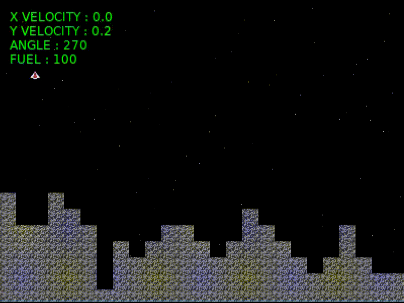

# Quite simple Lunar Lander game

To land the spaceship successfuly:
* Keep the vertical and horizontal velocity inferior to 1.
* Keep the ship angle between 265° and 275°.
* Have some fuel left.

Controls: 
* UP = turn engine on/accelerate (go against gravity), but careful fuel goes away really fast :)
* RIGHT/LEFT = incline ship

