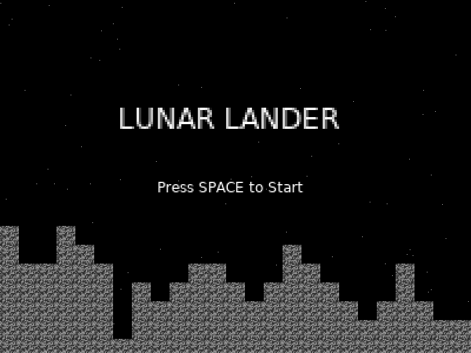
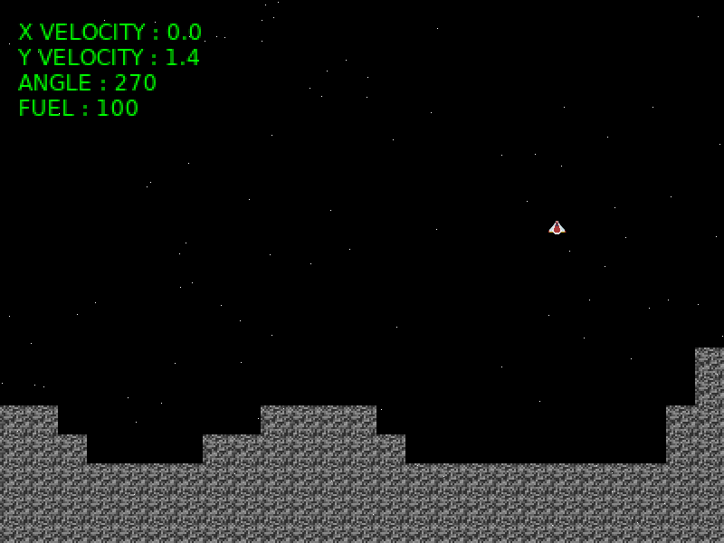

# Quite basic Lunar Lander game

To land the spaceship successfuly you must :

* Keep the vertical and horizontal velocity inferior to 1.
* Keep the ship angle between 265° and 275°.
* Have some fuel left.

You control the spaceship with the arrows and press the up arrow to turn the engine on and accelerate (and go against gravity), but be careful : fuel goes away really fast !

